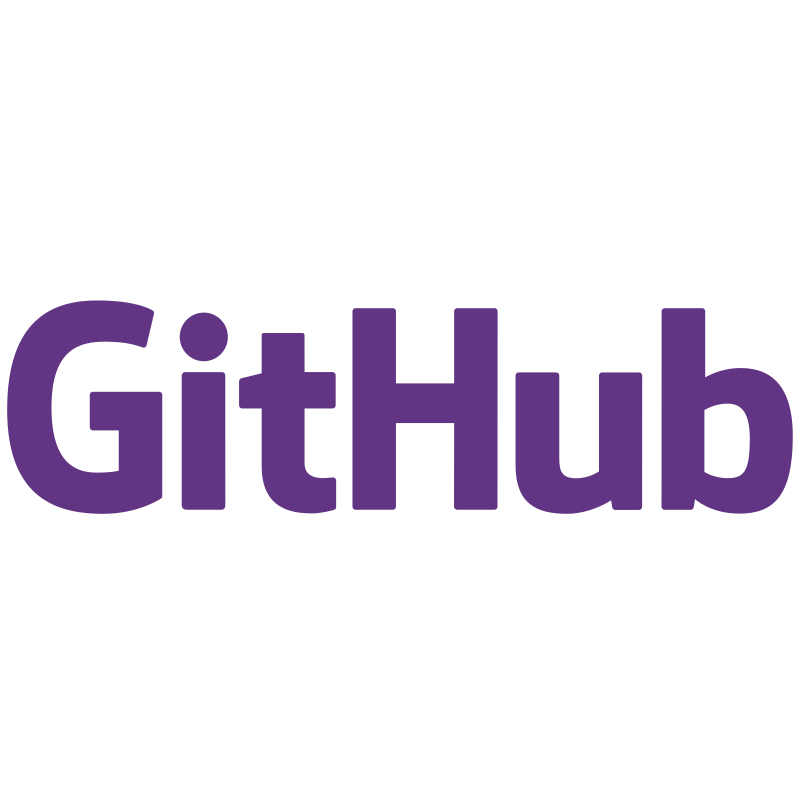
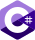

#  Bienvenid@ a mi perfil de GitHub

Soy Manuel García, actualmente, en la Universidad de Salamanca, estudiando el grado de Ingeniería Informática.

## 🛠️ Mis conocimientos

### Lenguajes de programación

  
Un lenguaje de programación de propósito general, conocido por su eficiencia y control sobre los recursos del sistema. Es ampliamente utilizado en sistemas embebidos y desarrollo de sistemas operativos. Pulse aquí para leer más sobre [**C**](https://www.gnu.org/software/gnu-c-manual/gnu-c-manual.pdf).

  
Una extensión de C con características de programación orientada a objetos. Usado en desarrollo de software de alto rendimiento, juegos, motores gráficos, y aplicaciones de tiempo real. Pulse aquí para leer más sobre [**C++**](https://en.cppreference.com/w/cpp).

  
Un lenguaje de programación moderno y orientado a objetos desarrollado por Microsoft. Es ampliamente utilizado en el desarrollo de aplicaciones de escritorio, aplicaciones web y juegos. Pulse aquí para leer más sobre [**C#**](https://learn.microsoft.com/en-us/dotnet/csharp/tour-of-csharp/).

  
Un lenguaje de programación de alto nivel, conocido por su sintaxis clara y legible. Es ampliamente utilizado en desarrollo web, análisis de datos, inteligencia artificial y automatización de tareas. Pulse aquí para leer más sobre [**Python**](https://www.python.org/doc/).

  
Un lenguaje de programación de sistemas que se centra en la seguridad y el rendimiento. Es ampliamente utilizado en el desarrollo de software de alto rendimiento y sistemas críticos. Pulse aquí para leer más sobre [**Rust**](https://doc.rust-lang.org/book/).

  
Un lenguaje de programación moderno desarrollado por Apple para el desarrollo de aplicaciones iOS, macOS, watchOS y tvOS. Pulse aquí para leer más sobre [**Swift**](https://swift.org/documentation/).

  
Un lenguaje de marcado utilizado en el desarrollo web para estructurar y presentar contenido. Es la base de cualquier página web y se utiliza junto con CSS y JavaScript. Pulse aquí para leer más sobre [**HTML**](https://developer.mozilla.org/en-US/docs/Web/HTML).

  
Un lenguaje de estilos utilizado en el desarrollo web para dar estilo y diseño a las páginas HTML. Es esencial para crear páginas web atractivas y responsivas. Pulse aquí para leer más sobre [**CSS**](https://developer.mozilla.org/en-US/docs/Web/CSS).

  
Un lenguaje de scripting utilizado en sistemas Unix y Linux para automatizar tareas y procesos. Es esencial para administrar sistemas y servidores. Pulse aquí para leer más sobre [**Shell Script**](https://www.gnu.org/software/bash/manual/bash.html).  

  
Un lenguaje de programación para gestionar bases de datos relacionales. Es ampliamente utilizado en el desarrollo de aplicaciones empresariales y sistemas de gestión de bases de datos. Pulse aquí para leer más sobre [**SQL**](https://www.w3schools.com/sql/).

  
Un lenguaje de programación de alto nivel, interpretado por el navegador, que se utiliza para crear páginas web interactivas y dinámicas. Pulse aquí para leer más sobre [**JavaScript**](https://developer.mozilla.org/en-US/docs/Web/JavaScript). 

  
Un lenguaje de programación de código abierto desarrollado por Microsoft que es un superconjunto de JavaScript. Es ampliamente utilizado en el desarrollo de aplicaciones web y móviles. Pulse aquí para leer más sobre [**TypeScript**](https://www.typescriptlang.org/docs/).

  
Un lenguaje de programación de propósito general, conocido por su capacidad para procesar texto y realizar tareas administrativas. Es ampliamente utilizado en el desarrollo web y la administración de sistemas. Pulse aquí para leer más sobre [**Perl**](https://www.perl.org/).

  
Un lenguaje de programación de alto nivel y un entorno interactivo utilizado en matemáticas, ingeniería y ciencias. Es ampliamente utilizado en el procesamiento de señales, la simulación y el análisis de datos. Pulse aquí para leer más sobre [**Matlab**](https://www.mathworks.com/help/matlab/).

  
Un lenguaje de programación de sistemas diseñado para ser seguro, eficiente y fácil de usar. Es ampliamente utilizado en el desarrollo de software de alto rendimiento y sistemas críticos. Pulse aquí para leer más sobre [**Zig**](https://ziglang.org/).

  
Un lenguaje de bajo nivel utilizado para programación cercana al hardware. Es fundamental para entender cómo interactúa el software con el hardware a nivel de instrucciones. Pulse aquí para leer más sobre [**Assembly**](https://en.wikipedia.org/wiki/Assembly_language).

  
Un lenguaje de programación de propósito general y orientado a objetos desarrollado por Sun Microsystems. Es ampliamente utilizado en el desarrollo de aplicaciones empresariales y móviles. Pulse aquí para leer más sobre [**Java**](https://docs.oracle.com/en/java/).  

  
Un lenguaje de programación lógica utilizado en inteligencia artificial y procesamiento de lenguaje natural. Es ampliamente utilizado en la resolución de problemas lógicos y la inferencia de conocimientos. Pulse aquí para leer más sobre [**Prolog**](https://www.swi-prolog.org/).

### Frameworks

  
Un framework de desarrollo de software de Microsoft que se utiliza para crear aplicaciones web, aplicaciones de escritorio y servicios en la nube. Pulse aquí para leer más sobre [**.NET**](https://learn.microsoft.com/en-us/dotnet/).

  
Un framework de desarrollo web basado en TypeScript que se utiliza para crear aplicaciones web de una sola página. Es ampliamente utilizado en el desarrollo de aplicaciones empresariales y aplicaciones móviles. Pulse aquí para leer más sobre [**Angular**](https://angular.io/).  

  
Un framework de alto nivel para el desarrollo web en Python que se utiliza para crear aplicaciones web rápidas y seguras. Es ampliamente utilizado en el desarrollo de aplicaciones web y sitios web. Pulse aquí para leer más sobre [**Django**](https://www.djangoproject.com/).

  
Un framework de código abierto para crear aplicaciones nativas multiplataforma que se utiliza para crear aplicaciones móviles rápidas y atractivas. Es ampliamente utilizado en el desarrollo de aplicaciones móviles y aplicaciones web. Pulse aquí para leer más sobre [**Flutter**](https://flutter.dev/).

  
Una biblioteca de JavaScript para construir interfaces de usuario que se utiliza para crear aplicaciones web interactivas y dinámicas. Es ampliamente utilizado en el desarrollo de aplicaciones web y aplicaciones móviles. Pulse aquí para leer más sobre [**React**](https://reactjs.org/).

  
Un framework de código abierto para crear aplicaciones de escritorio multiplataforma que se utiliza para crear aplicaciones de escritorio nativas con tecnologías web. Es ampliamente utilizado en el desarrollo de aplicaciones de escritorio y aplicaciones web. Pulse aquí para leer más sobre [**Electron**](https://www.electronjs.org/).  

  
Un entorno de ejecución de JavaScript basado en el motor V8 de Google Chrome que se utiliza para crear aplicaciones de servidor y aplicaciones web. Es ampliamente utilizado en el desarrollo de aplicaciones web y aplicaciones móviles. Pulse aquí para leer más sobre [**Node.js**](https://nodejs.org/).

### Bases de datos

  
Una base de datos NoSQL orientada a documentos que se utiliza para almacenar datos no estructurados y semiestructurados. Es ampliamente utilizado en el desarrollo de aplicaciones web y aplicaciones móviles. Pulse aquí para leer más sobre [**MongoDB**](https://www.mongodb.com/).

  
Un sistema de gestión de bases de datos relacionales de código abierto que se utiliza para almacenar y gestionar datos relacionales. Es ampliamente utilizado en el desarrollo de aplicaciones web y aplicaciones empresariales. Pulse aquí para leer más sobre [**MySQL**](https://www.mysql.com/).

  
Un sistema de gestión de bases de datos relacionales de código abierto, bifurcado de MySQL, que se utiliza para almacenar y gestionar datos relacionales. Es ampliamente utilizado en el desarrollo de aplicaciones web y aplicaciones empresariales. Pulse aquí para leer más sobre [**MariaDB**](https://mariadb.org/).

  
Un sistema de gestión de bases de datos distribuidas de código abierto que se utiliza para almacenar y gestionar datos distribuidos. Es ampliamente utilizado en el desarrollo de aplicaciones web y aplicaciones empresariales. Pulse aquí para leer más sobre [**SurrealDB**](https://surrealdb.com/).

### Motores de juegos

  
Un motor de juegos de código abierto que se utiliza para crear juegos 2D y 3D multiplataforma. Es ampliamente utilizado en el desarrollo de juegos indie y juegos comerciales. Pulse aquí para leer más sobre [**Godot**](https://docs.godotengine.org/en/stable/).

  
Un motor de juegos multiplataforma que se utiliza para crear juegos 2D y 3D. Es ampliamente utilizado en el desarrollo de juegos indie y juegos comerciales. Pulse aquí para leer más sobre [**Unity**](https://docs.unity.com/).

  
Un motor de juegos desarrollado por Epic Games que se utiliza para crear juegos 2D y 3D. Es ampliamente utilizado en el desarrollo de juegos AAA y juegos comerciales. Pulse aquí para leer más sobre [**Unreal**](https://dev.epicgames.com/documentation/en-us/unreal-engine/unreal-engine-5-4-documentation).

### Otras herramientas útiles

  
Un sistema de control de versiones distribuido que se utiliza para rastrear cambios en el código fuente durante el desarrollo de software. Es ampliamente utilizado en el desarrollo de software colaborativo. Pulse aquí para leer más sobre [**Git**](https://git-scm.com/doc).

  
Una plataforma de desarrollo de software basada en la nube que se utiliza para alojar, revisar y colaborar en proyectos de código abierto. Es ampliamente utilizado en el desarrollo de software y la colaboración en equipo. Pulse aquí para leer más sobre [**GitHub**](https://docs.github.com/).

  
Una plataforma de contenedores que se utiliza para empaquetar, distribuir y ejecutar aplicaciones en entornos aislados. Es ampliamente utilizado en el desarrollo de software y la administración de sistemas. Pulse aquí para leer más sobre [**Docker**](https://docs.docker.com/).

  
Un conjunto de aplicaciones de software creativas desarrolladas por Adobe que se utilizan para crear contenido digital, gráficos y diseño. Es ampliamente utilizado en el diseño gráfico, la edición de fotos y el diseño web. Pulse aquí para leer más sobre [**Adobe**](https://helpx.adobe.com/support.html).

  
Un software de modelado, animación y renderizado 3D de código abierto que se utiliza para crear contenido 3D, animaciones y efectos visuales. Es ampliamente utilizado en la producción de películas, juegos y animaciones. Pulse aquí para leer más sobre [**Blender**](https://docs.blender.org/).

  
Una herramienta de diseño de interfaz de usuario basada en la web que se utiliza para crear prototipos, maquetas y diseños de aplicaciones y sitios web. Es ampliamente utilizado en el diseño de productos digitales y la colaboración en equipo. Pulse aquí para leer más sobre [**Figma**](https://www.figma.com/).

  
Un servidor web de código abierto que se utiliza para alojar sitios web y aplicaciones web. Es ampliamente utilizado en el desarrollo web y la administración de servidores. Pulse aquí para leer más sobre [**Apache**](https://httpd.apache.org/docs/).

  
Un conjunto de aplicaciones de productividad desarrolladas por Microsoft que se utilizan para crear documentos, hojas de cálculo y presentaciones. Es ampliamente utilizado en el trabajo de oficina y la colaboración en equipo. Pulse aquí para leer más sobre [**Office**](https://support.microsoft.com/en-us/office).

  
Un editor de código de código abierto desarrollado por Microsoft que se utiliza para escribir y editar código fuente. Es ampliamente utilizado en el desarrollo de software y la administración de archivos. Pulse aquí para leer más sobre [**Visual Studio Code**](https://code.visualstudio.com/). Es mi IDE preferido, y a continuación explico cómo está configurado para mi uso, junto al por qué lo prefiero.

  
Un editor de texto avanzado de código abierto que se utiliza para escribir y editar código fuente. Es ampliamente utilizado en el desarrollo de software y la administración de archivos. Pulse aquí para leer más sobre [**Kate**](https://kate-editor.org/).

  
Una biblioteca de cifrado de código abierto que se utiliza para implementar protocolos de seguridad en aplicaciones web y servicios en la nube. Es ampliamente utilizado en el desarrollo de software y la administración de sistemas. Pulse aquí para leer más sobre [**OpenSSL**](https://www.openssl.org/docs/).

  
Un estándar de cifrado de código abierto que se utiliza para proteger la privacidad y la seguridad de la información. Es ampliamente utilizado en el cifrado de correos electrónicos y la firma digital. Pulse aquí para leer más sobre [**OpenPGP**](https://tools.ietf.org/html/rfc4880).

### Sistemas operativos  

  
Un sistema operativo desarrollado por Microsoft que se utiliza en computadoras personales, servidores y dispositivos móviles. Es ampliamente utilizado en el trabajo de oficina y la administración de sistemas. Pulse aquí para leer más sobre [**Windows**](https://support.microsoft.com/en-us/windows).

  
Un sistema operativo de código abierto basado en el kernel de Linux que se utiliza en servidores, supercomputadoras y dispositivos embebidos. Es ampliamente utilizado en el desarrollo de software y la administración de sistemas. Pulse aquí para leer más sobre [**Linux**](https://www.linux.org/). En mi caso, uso la distribución [**Arch Linux**](https://wiki.archlinux.org/), que es una distribución de Linux avanzada y personalizable, lo que me permite adaptarla a mis necesidades y preferencias.

## Mi IDE

	
	 

Visual Studio Code - Insiders (VS Code) es mi IDE porque es increíblemente versátil y se adapta a una amplia variedad de lenguajes de programación. Aquí te cuento por qué me resulta tan útil:
  
  - Soporte Multilenguaje:
  - Funciones útiles:
  - Extensiones:
  
Uso la versión Insiders de VS Code porque es una versión preliminar que recibe actualizaciones diarias con las últimas características y correcciones de errores. Es ideal para mí, ya que quiero estar a la vanguardia y probar las nuevas funcionalidades antes de que sean lanzadas en la versión estable.  
