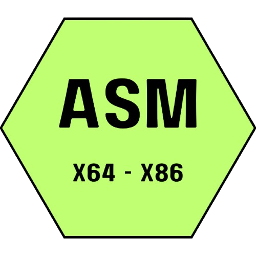

<!-- Inicio: declaración de estilos de la página -->

<h1> 
	
	Bienvenid@ a mi perfil de GitHub 
</h1>

 Soy Manuel García, actualmente, en la Universidad de Salamanca, estudiando el grado de Ingeniería Informática 

## About me

...  

## Mis conocimientos

- Lenguajes de programación:

<ul>
    <li class="list-item" style="display: flex; align-items: center; margin-bottom: 10px; text-align: justify;">
		
		<a href="https://portal.abuad.edu.ng/lecturer/documents/1595247580Fundamental_of_Assembly_Language.pdf" target="_blank">
			<strong>Assembly</strong></a>: .
	</li>
    <li class="list-item" style="display: flex; align-items: center; margin-bottom: 10px; text-align: justify;">
		
		<a href="https://www.gnu.org/software/gnu-c-manual/gnu-c-manual.pdf" target="_blank">
			<strong>C</strong></a>: Un lenguaje de propósito general que ha influido en muchos otros lenguajes.
	</li>

	<li class="list-item">
		
		<a href="https://learn.microsoft.com/en-us/dotnet/csharp/tour-of-csharp/" target="_blank">
			<strong>C#</strong></a>: Un lenguaje moderno y orientado a objetos desarrollado por Microsoft.
	</li>
	<li class="list-item">
		
		<a href="https://cplusplus.com" target="_blank">
			<strong>C++</strong></a>: Un lenguaje de propósito general de programación orientada a objetos.
	</li>
	<li class="list-item">
		
		<a href="https://doc.rust-lang.org/book/" target="_blank">
			<strong>Rust</strong></a>: Un lenguaje que se centra en la seguridad y el rendimiento.
	</li>
	<li class="list-item">
		
		<a href="https://www.python.org/doc/" target="_blank">
			<strong>Python</strong></a>: Un lenguaje que se centra en la seguridad y el rendimiento.
	</li>
    <li class="list-item">
		
		<a href="https://lenguajehtml.com/" target="_blank">
			<strong>HTML</strong></a>: .
	</li>
    <li class="list-item">
		
		<a href="https://lenguajecss.com/" target="_blank">
			<strong>CSS</strong></a>: .
	</li>
    <li class="list-item">
        
        <a href="" target="_blank"><strong>SQL</strong></a>: Un lenguaje de programación para gestionar bases de datos relacionales.
    </li>
    <li class="list-item">
		
		<a href="" target="_blank">
			<strong>Swift</strong></a>: .
	</li>
    <li class="list-item">
        
        <a href="" target="_blank"><strong>Shell Script</strong></a>:.
    </li>
    <li class="list-item">
        
        <a href="" target="_blank"><strong>Perl</strong></a>:.
    </li>
    <li class="list-item">
        
        <a href="" target="_blank"><strong>JavaScript</strong></a>:.
    </li>
    <li class="list-item">
        
        <a href="" target="_blank"><strong>Java</strong></a>:.
    </li>
    <li class="list-item">
        
        <a href="" target="_blank"><strong>Matlab</strong></a>:.
    </li>
    <li class="list-item">
        
        <a href="" target="_blank"><strong>Zig</strong></a>:.
    </li>
</ul>

###
- Frameworks:
<ul>
    <li class="list-item">
		
		<a href="https://learn.microsoft.com/en-us/dotnet/" target="_blank">
			<strong>.NET</strong></a>: .
	</li>
    <li class="list-item">
        
        <a href="https://angular.io/" target="_blank"><strong>Angular</strong></a>: Un framework de desarrollo web basado en TypeScript.
    </li>
    <li class="list-item">
        
        <a href="https://www.djangoproject.com/" target="_blank"><strong>Django</strong></a>: Un framework de alto nivel para el desarrollo web en Python.
    </li>
    <li class="list-item">
        
        <a href="https://flutter.dev/" target="_blank"><strong>Flutter</strong></a>: Un framework de código abierto para crear aplicaciones nativas multiplataforma.
    </li>
    <li class="list-item">
        
        <a href="https://reactjs.org/" target="_blank"><strong>React</strong></a>: Una biblioteca de JavaScript para construir interfaces de usuario.
    </li>
    <li class="list-item">
        
        <a href=""_blank"><strong>Electron</strong></a>: .
    </li>
</ul>

- Gestores de bases de datos:  
<ul>
    <li class="list-item">
        
        <a href="https://www.mongodb.com/es" target="_blank"><strong>MongoDB</strong></a>: Una base de datos NoSQL orientada a documentos.
    </li>
    <li class="list-item">
        
        <a href="https://www.mysql.com/" target="_blank"><strong>MySQL</strong></a>: Un sistema de gestión de bases de datos relacionales de código abierto.
    </li>
    <li class="list-item">
        
        <a href="https://mariadb.org/" target="_blank"><strong>MariaDB</strong></a>: Un sistema de gestión de bases de datos relacionales de código abierto, bifurcado de MySQL.
    </li>
</ul>

- Motores:  
<ul>
    <li class="list-item">
		
		<a href="https://docs.godotengine.org/en/stable/" target="_blank">
			<strong>Godot</strong></a>: Un motor de juegos de código abierto.
	</li>
    <li class="list-item">
		
		<a href="https://docs.unity.com/" target="_blank">
			<strong>Unity</strong></a>: Un motor de juegos multiplataforma.
	</li>
    <li class="list-item">
		
		<a href="https://dev.epicgames.com/documentation/en-us/unreal-engine/unreal-engine-5-4-documentation" target="_blank">
			<strong>Unreal</strong></a>: Un motor de juegos desarrollado por Epic Games.
	</li>
</ul>

- Otras herramientas útiles:
<ul>
    <li class="list-item">
		
		<a href="" target="_blank">
			<strong>Adobe</strong></a>: Una suite de software de diseño gráfico, edición de vídeo y desarrollo web.
	</li>
    <li class="list-item">
		
		<a href="" target="_blank">
			<strong>Open Office Suite</strong></a>: Una suite de oficina de código abierto.
	</li>
    <li class="list-item">
		
		<a href="" target="_blank">
			<strong>Microsoft 356</strong></a>: Una suite de productividad de Microsoft.
	</li>
    <li class="list-item">
		
		<a href="" target="_blank">
			<strong>Blender </strong></a>: Un software de diseño y modelado 3D de código abierto.
	</li>
    <li class="list-item">
        
        <a href="https://git-scm.com/" target="_blank"><strong>Git</strong></a>: Un sistema de control de versiones distribuido.
    </li>
</ul>

## Mi IDE

	
	 

Visual Studio Code - Insiders (VS Code) es mi IDE porque es increíblemente versátil y se adapta a una amplia variedad de lenguajes de programación. Aquí te cuento por qué me resulta tan útil:
  
  - Soporte Multilenguaje:
  - Funciones útiles:
  - Extensiones:
  
Uso la versión Insiders de VS Code porque es una versión preliminar que recibe actualizaciones diarias con las últimas características y correcciones de errores. Es ideal para mí, ya que quiero estar a la vanguardia y probar las nuevas funcionalidades antes de que sean lanzadas en la versión estable.  
